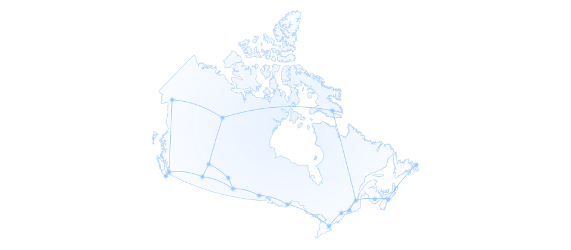

# MeshCore Canada

Bienvenue! Nous améliorons activement ce site. Vous avez trouvé quelque chose
de difficile à comprendre ou de désuet?
[Signalez-le sur GitHub](https://github.com/MeshCore-ca/MeshCore-Canada/issues/new/choose).

Réseau illustratif · <a href="../assets/regions/NOTICE.txt">Sources cartographiques</a>

## Que cherchez-vous? { #start-with-your-goal }

-   :material-message-text:{ .lg .middle } **Vous découvrez MeshCore?**

    ---

    Configurez votre radio LoRa et rejoignez un réseau MeshCore au Canada.

    [:octicons-arrow-right-24: Commencer la configuration guidée](start/index.md)

-   :material-map-marker-radius:{ .lg .middle } **Trouver des gens près de chez vous**

    ---

    Trouvez des communautés, des contacts et les paramètres radio de votre région.

    [:octicons-arrow-right-24: Trouver une communauté](provinces/index.md)

-   :material-map-search:{ .lg .middle } **Trouver votre région MeshCore**

    ---

    Voyez quelle région MeshCore canadienne couvre votre emplacement.

    [:octicons-arrow-right-24: Trouver ma région](config/map.md)

## Quel type d’appareil configurez-vous? { #choose-a-role }

-   :material-cellphone-link:{ .lg .middle } **Appareil compagnon**

    Envoyez et recevez des messages.

    [:octicons-arrow-right-24: Configurer un compagnon](start/companion.md)

-   :material-radio-tower:{ .lg .middle } **Répéteur**

    Améliorez la couverture locale.

    [:octicons-arrow-right-24: Configurer un répéteur](start/repeater.md)

-   :material-forum:{ .lg .middle } **Serveur de salon**

    Gardez un salon partagé accessible.

    [:octicons-arrow-right-24: Configurer un serveur de salon](start/room-server.md)

-   :material-chart-timeline-variant:{ .lg .middle } **Observateur**

    Transmettez des données du réseau à CoreScope.

    [:octicons-arrow-right-24: Configurer un observateur](start/observer.md){ .mc-observer-link }

Vous hésitez? [Comparez les types d’appareils](start/choose-a-goal.md).

Besoin de parler à quelqu’un? Rejoignez le
[Discord national](https://discord.gg/BESFVMt7yk), posez votre question sur le
[forum communautaire](https://forum.meshcore.ca/) ou consultez le
[réseau canadien en direct](https://live.meshcore.ca/).

## Paramètres radio par défaut au Canada { #canada-baseline }

Utilisez ces paramètres, sauf si votre communauté en indique d’autres.

| Paramètre | Valeur par défaut au Canada |
|---|---|
| Préréglage radio | **USA/Canada (Recommended)** |
| Valeurs radio détaillées | `910.525 MHz / 62.5 kHz / SF7 / CR5` |
| Hachage des chemins | **3 octets** |
| Commande correspondante | `set path.hash.mode 2` |

Prévu : un préréglage <strong>Canada</strong> distinct, avec les mêmes paramètres radio que <strong>USA/Canada</strong> et un hachage de 3 octets par défaut pour tous les types d’appareils. <a href="https://github.com/meshcore-dev/MeshCore/issues/3302">Suivre la discussion</a>.

## Améliorer MeshCore Canada

Quelque chose manque ou porte à confusion?
[Partagez une idée](submit-idea.md) ou
[mettez à jour une communauté](contributing.md).

## À propos du projet

MeshCore Canada est un projet communautaire indépendant.
[Apprenez-en plus](about.md) ou [contribuez au projet](contributing.md).
